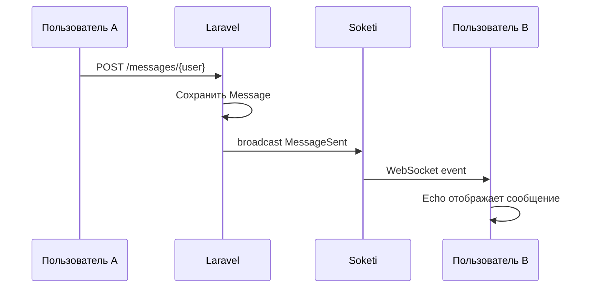

# Презентация к защите ВКР (MONO)

> Рекомендуемый объём: 12–15 слайдов, 7–10 минут.  
> Создайте в PowerPoint / Google Slides по этой структуре.

---

## Слайд 1 — Титульный

- ГАПОУ УКСИВТ
- **Разработка веб-платформы социальной сети MONO**
- Выпускная квалификационная работа
- Студент: ФИО, группа
- Руководитель: ФИО
- 2026

---

## Слайд 2 — Актуальность

- Рост потребности в автономных социальных платформах для учебных заведений
- Требования к конфиденциальности данных
- Необходимость realtime-коммуникаций

---

## Слайд 3 — Цель и задачи

**Цель:** разработка веб-платформы MONO для социального взаимодействия пользователей.

**Задачи:**
1. Анализ предметной области
2. Проектирование БД и UC-диаграммы
3. Реализация серверной и клиентской частей
4. Тестирование и документирование

---

## Слайд 4 — Технологический стек

| Backend | Frontend | Realtime | БД |
|---------|----------|----------|-----|
| PHP 8.1, Laravel 10 | Blade, Alpine.js, Tailwind | Echo, Pusher/Soketi | MySQL 8 |

---

## Слайд 5 — Функциональность

- Регистрация и профили
- Лента публикаций (текст + до 9 фото)
- Реакции и комментарии (ветвление)
- Подписки и поиск
- Личные сообщения (текст, файлы, голос)
- Уведомления в realtime
- Роли: участник, модератор, администратор

---

## Слайд 6 — Диаграмма вариантов использования

*(Вставить экспорт из `grafika/01-use-case.mmd`)*

13 вариантов использования, 4 актора.

---

## Слайд 7 — Структура базы данных

*(Вставить ER-диаграмму из `grafika/02-er-diagram.mmd`)*

8 основных таблиц: users, posts, comments, follows, messages, reactions, notifications + служебные.

---

## Слайд 8 — Модульная архитектура

*(Вставить схему из `grafika/03-modules.mmd`)*

MVC Laravel: Auth, Feed, Engagement, Profile, Chat, Notifications, API.

---

## Слайд 9 — Realtime-подсистема

---

## Слайд 10 — Контрольный пример

| Действие | Результат |
|----------|-----------|
| Пост «Привет, MONO!» | Запись в posts |
| Реакция heart | notifications |
| Комментарий | comment + notify |
| Сообщение | realtime доставка |

---

## Слайд 11 — Тестирование

6 тест-кейсов: регистрация, неверный пароль, создание поста, реакция, WebSocket, валидация.

**Результат:** все тесты пройдены.

---

## Слайд 12 — Демонстрация

*(Скриншоты: лента, профиль, чат, уведомления)*

URL: http://mono-net (локальный стенд OSPanel)

---

## Слайд 13 — Результаты и перспективы

**Достигнуто:**
- Готовый программный продукт
- Документация и API
- Развёртывание на OSPanel / production

**Перспективы:**
- Мобильное приложение (Sanctum API)
- Рекомендации по interest_tags
- Групповые чаты

---

## Слайд 14 — Заключение

Цель и задачи выполнены. Продукт MONO соответствует заданию и пригоден для использования в учебном заведении.

**Спасибо за внимание!**

---

## Слайд 15 — Вопросы

Контакт / репозиторий проекта (по желанию).
